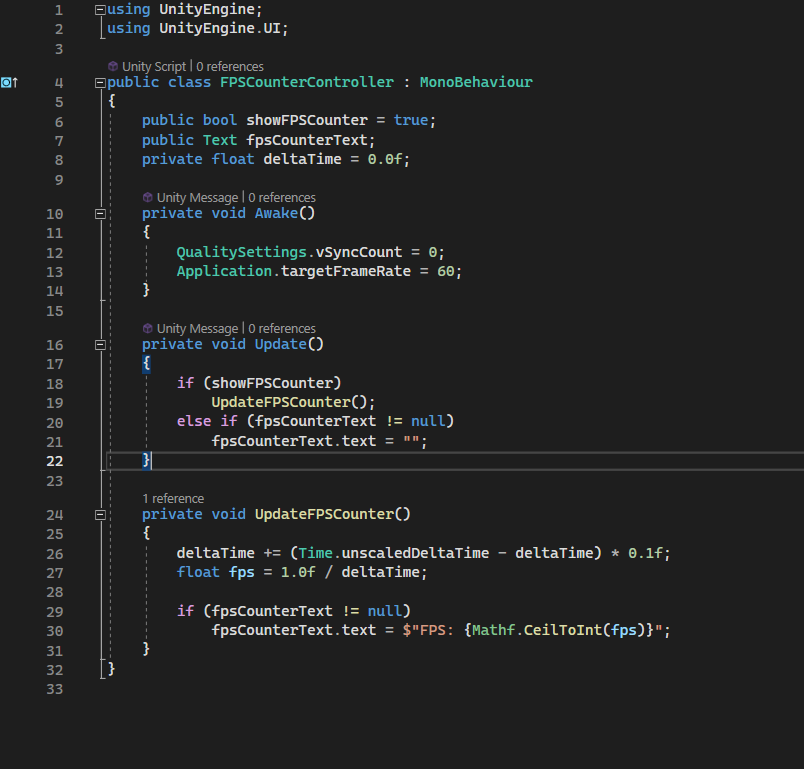

# FPSCounterController Documentation

## Overview

The **FPSCounterController** script empowers you with precise control over the display of an FPS (Frames Per Second) counter on your screen during gameplay. It grants you the ability to effortlessly toggle the visibility of the FPS counter, ensuring that your counter is always accurate.

## Features

- Toggle the visibility of the FPS counter using a simple boolean flag.
- Display the real-time frames per second (FPS) on your screen for easy monitoring.
- Experience the magic of automatic FPS calculation and updates.

## Usage

### Attach the Script

1. Attach the **FPSCounterController** script to a GameObject in your scene.

### Inspector Parameters

- **Show FPS Counter**: Toggle this flag to determine whether the FPS counter is shown during gameplay. If unchecked, the counter remains hidden.

- **FPS Counter Text**: Link a Text UI element to this field in the Inspector. This element will elegantly display the FPS counter.

### Functionality

- The script sets the Quality Settings vSync Count to 0 and the Application target frame rate to 60 in its `Awake()` method, ensuring your game maintains a consistent frame rate.

- If the "Show FPS Counter" flag is enabled, the script dynamically calculates and updates the FPS counter using the `UpdateFPSCounter()` method. If the flag is disabled, the counter remains discreetly hidden.

- The `UpdateFPSCounter()` method calculates the frames per second based on the time between frames and seamlessly updates the associated Text UI element.

- We've got you covered! A meticulous null check is performed for the `fpsCounterText` field to ensure that pesky errors stay at bay—even if the UI element is not assigned or unexpectedly disappears during runtime.

## Example

1. Attach the **FPSCounterController** script to a GameObject in your scene.

2. In the Inspector, encounter the "Show FPS Counter" checkbox and the "FPS Counter Text" field. Seamlessly assign a Text UI element to the "FPS Counter Text" field to unveil the FPS counter's charm.

3. Immerse yourself in the gameplay experience—the FPS counter elegantly graces the top of your screen, dynamically updating as your frame rate dances to the rhythm of the game.

## Notes

- Your journey to enlightenment begins with a simple step: assign a Text UI element to the "FPS Counter Text" field to bask in the glory of the FPS counter's visual symphony.

- This script was meticulously crafted to be your ultimate ally in debugging and fine-tuning frame rates during the intricate dance of development.

---

*Celebrate each frame with the FPSCounterController!*-
